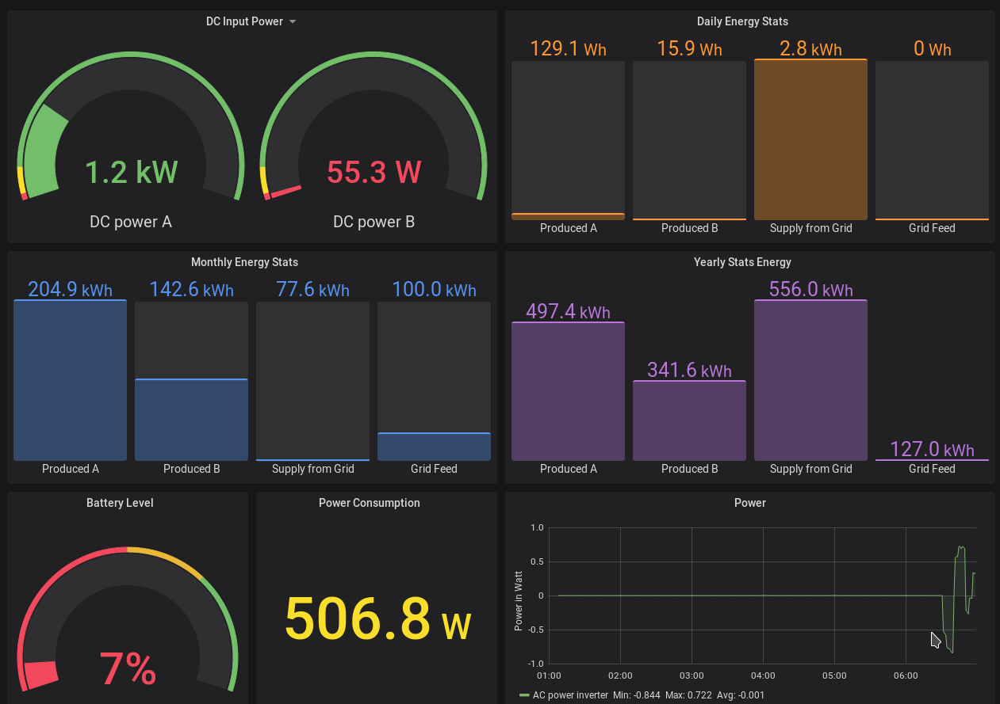

# Introduction

The data logger for RCT inverters was developed to the inverter data available not only in the mobile app provided by RCT but also in an own smart home solution. From this Github page you only need the latest jar file rctDataServer-<version>.jar, download the file with the highest version number (to be found in release folder). The application was developed in Java and should therefore run on Windows, Linux and MacOS. The jar file can be saved somewhere on the hard disk.

# Requirements
## Java
Java must be installed. If you are not sure if you have Java installed, just type "java -version" (without the quotation marks) in a command line window to see if Java is installed and what version. The application has been tested so far with 

- Sun Java 1.8 64-bit on Windows 
- Sun Java 1.8 64-bit on Raspberry Pi
- openJDK 11 on Linux

Other Java versions may or may not work.

## Configuration File
A configuration file must be created and adjusted before the first start. This file must have the name rctDataServer.properties, please pay attention to upper and lower case.

Please store this configuration file under Windows in C:\Users\<User-Name>\AppData\Local\rctDataServerConfig. The subdirectory rctDataServerConfig must be created by the user. If Linux is used please put the file in /home/<user-name>/.local/share/rctDataServerConfig/, if Mac is used please put it in <user-home>\AppData\Local\rctDataServerConfig\. Again, please pay attention to upper and lower case.

The minimal content of the file should look like this:

```
hostnameInverter = 1.1.1.1
portInverter = 8899
logLevel = debug
timeoutInverter = 3000
```
Attention, you have to adjust the first value and enter the IP address of your inverter. You might also have to change the second parameter, 8899 is the default port of the inverter. Hence, if you are not aware that you changed it, then please leave it as it is.

Optionally you can enter the following parameters

```
panelPower = 200
panelsA = 10
panelsB = 12
```
These are purely optional parameters and are used to check whether the values determined are correct. If discrepancies are found, they are logged. PanelPower is the power of a single solar module in Watt, panelsA and panelsB are the number of modules in string A and B respectively. The above values are only exemplary here and have to be adjusted due to the actual installation.

# Application
## Start-up
Depending on how your computer is configured you can start Java programs in different ways. On some computers you can start them with a double click, I would always start them on the command line to see what happens.
Open a command line window, then navigate to the directory where you put the jar file. In the directory "java -jar rctDataServer-<version>.jar" (without the quotation marks and replace <version> with the version number in your file). Some messages will run across the screen, after a few seconds the output should stop and you should see 

```
<<<<< INFO >>>>> Inverter::connect Connected successfully to inverter. 
```
Now the connection is established.

## Easy to use
There are several ways to use the application. The easiest way is via a browser
(tested with Chrome and Firefox) to call the URL 'http://localhost:8080/charts.html'. This gives you access to a simple UI. This simple UI has only limited functionality and is not intended to replace a complete reporting application.

## Influx Connection
Mainly the tool was built to store the data in an Influx DB. The data of the Influx DB can then be read out and evaluated via Grafana (or other applications). To realize the connection to Influx you just have to set the connection parameters in the configuration file above

```
influxdbServer = localhost
influxdbPort = 8086
```
The server name and the server port have to be adjusted according to the Influx installation. By default a measurement value is requested every minute and stored in the InfluxDB. A Grafana dashboard might look like as in the following example:



## Technical test
Another way to retrieve data is to use a browser to request certain values. Basically this is a good way to test if the application is running. Otherwise you can also use this http interface if you want to integrate the data into your own applications.

For example to get the input voltage at string A open the URL

```
http://localhost:8080/getData?magicNumber=B55BA2CE
```
As always, please pay attention to upper and lower case. You will get a so called JSON file displayed in your browser


```json
{"type": "short", "magicNumber": "B55BA2CE", "value":530.0684, "text": "DC input voltage A in V", "timestamp":1601104412, "success":true}
```
Important for the first time is only the value in 'value', or that you get such an answer at all. Further details are only important if you want to write your own application and query the data this way. For more details please see the developer documentation.

